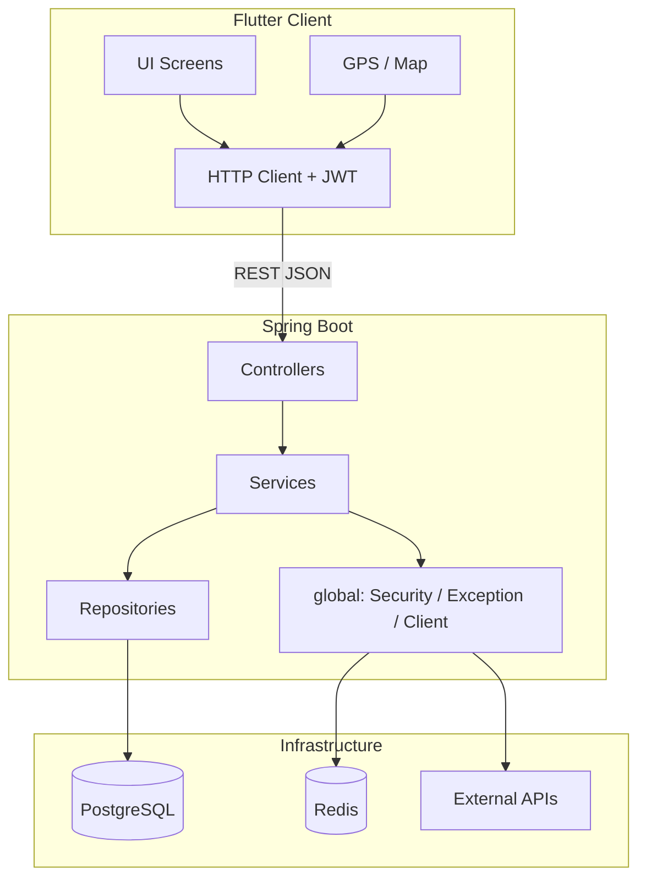

# Chungnam RouteMaker — Spring Backend

> **Frontend**: Flutter (MVVM + Feature-first)  
> **Backend**: Spring (DDD / Layered Architecture)  

---

## Github Guidline

| Prefix | 용도 | 예시 상황 |
|--------|------|-----------|
| `feat` | 새로운 기능(Feature) 추가 | API, 비즈니스 로직, 스케줄러 등 **동작이 추가**될 때 |
| `fix` | 버그·에러 수정(Fix) | 잘못된 동작, 장애, 데이터 오류 등 **문제 해결** |
| `chore` | 빌드·인프라·설정 | 패키지, 환경 변수, 키 파일, Gradle 등 **기능과 무관한 유지보수** |
| `docs` | 문서(Documentation) | README, API 명세, 아키텍처 문서 등 |
| `refactor` | 구조 개선(Refactor) | **기능은 동일**, 코드 정리·분리·이름 변경 |
| `style` | 포맷·린트 | 세미콜론, import 정리 등 **로직 변경 없음** |

#### feat — 새 기능

```
feat: 맞춤형 3단 코스 추천 API 추가
```

#### fix — 버그 수정

```
fix: JWT 만료 시 401 대신 500이 반환되던 문제 수정
```

#### chore — 설정 변경

```
chore: Redis Docker Compose 설정 추가
```

#### docs — 문서

```
docs: Spring 아키텍처 및 Flutter 연동 가이드 README 추가
```

#### refactor — 구조 개선 (기능 동일)

```
refactor: PlaceService 필터 로직을 PlaceFilterService로 분리
```

---

# RouteMaker Backend

충남 지역(논산·공주·부여) 여행 코스 추천 앱 **RouteMaker**의 Spring Boot 백엔드입니다.

Flutter가 **클라이언트(UI·GPS·지도)**, Spring이 **비즈니스 로직·DB·외부 API 연동·인증**을 담당하는 **클라이언트–서버(C/S) 구조**입니다.

```
┌─────────────────┐         HTTPS/HTTP (REST + JSON)         ┌──────────────────────────┐
│  Flutter App    │  ──────────────────────────────────────► │  Spring Boot Backend     │
│  (Mobile)       │  ◄────────────────────────────────────── │  (routemaker_backend)    │
└─────────────────┘         ApiResponse<T> JSON              └───────────┬──────────────┘
                                                                           │
                                    ┌──────────────────────────────────────┼──────────────────────┐
                                    │                                      │                      │
                                    ▼                                      ▼                      ▼
                             PostgreSQL                                 Redis              외부 API
                             (영속 데이터)                            (캐시, 예정)      (기상청, TourAPI, Chak)
```

| 구분 | 역할 |
|------|------|
| **Flutter** | 화면, 사용자 입력, GPS/지도, JWT 로컬 저장, API 호출 |
| **Spring** | REST API, 인증/인가, 도메인 규칙, DB CRUD, 외부 API 중계 |
| **PostgreSQL** | User, Place, Course, Stamp 등 영속 데이터 |
| **Redis** | 캐시 (날씨·TourAPI 등, 추후 활용 예정) |

---

## 기술 스택

| 영역 | 기술 |
|------|------|
| Language | Java 17 |
| Framework | Spring Boot 4.1 |
| Web | Spring Web MVC (REST) |
| ORM | Spring Data JPA / Hibernate |
| DB | PostgreSQL 15 |
| Cache | Redis 7 |
| Security | Spring Security + JWT (Stateless) |
| Build | Gradle |
| Infra | Docker Compose (`postgres`, `redis`) |

---

## 아키텍처 설계 원칙

### DDD + Layered Architecture + Package by Feature

교과서적인 4계층(`presentation / application / domain / infrastructure`)을 **패키지 전체에 반복**하기보다, **기능(도메인) 단위로 패키지를 나누고**, 각 도메인 안에 **Layered 계층**을 두는 **실용형 구조**입니다.

```
요청 흐름 (한 도메인 내부)

  Flutter HTTP Request
        │
        ▼
  controller/     ← Presentation: REST 엔드포인트, 요청/응답 DTO 변환
        │
        ▼
  service/        ← Application: 유스케이스·비즈니스 규칙 조합
        │
        ├── repository/  ← Infrastructure(Persistence): JPA DB 접근
        ├── entity/      ← Domain Model: DB 테이블 매핑 객체
        └── dto/         ← API 전용 입출력 객체 (Entity 직접 노출 X)
```

### `global/` vs `domain/` 분리

| 패키지 | 역할 |
|--------|------|
| **`global/`** | 모든 도메인이 공유하는 **기술·인프라** (Security, CORS, 예외, 공통 응답, 외부 API Client) |
| **`domain/`** | **비즈니스 기능 단위** (user, place, course, military, reward) |

**규칙**

- 도메인 간 참조: `course → place` (조회), `reward → user` (조회)처럼 **단방향** 유지
- Entity는 API로 직접 반환하지 않고 **Response DTO**로 변환
- 외부 API(Tour, 기상청)는 `global/client` 또는 도메인 전용 `client/`에서 호출

---

## 패키지 구조

```
src/main/java/com/example/routemaker/
│
├── RoutemakerApplication.java          # Spring Boot 진입점
│
├── global/                             # 전역 공통
│   ├── config/                         # Security, CORS, Redis, JPA, Swagger
│   ├── security/                       # JWT Filter, UserDetailsService
│   ├── exception/                      # GlobalExceptionHandler, ErrorCode
│   ├── response/                       # ApiResponse<T> 공통 응답 래퍼
│   ├── client/                         # WeatherApiClient, TourApiClient
│   ├── common/enums/                   # Region (NONSAN, GONGJU, BUYEO)
│   └── util/                           # JwtUtil, DistanceUtil, DateTimeUtil
│
└── domain/
    ├── user/                           # 회원 · 인증 · 마이페이지
    │   ├── auth/                       # 회원가입/로그인 (user 하위)
    │   │   ├── controller/
    │   │   ├── service/
    │   │   └── dto/
    │   ├── controller/
    │   ├── service/
    │   ├── repository/
    │   ├── entity/
    │   └── dto/
    │
    ├── place/                          # 장소 (유적지/맛집/카페)
    │   ├── controller/
    │   ├── service/
    │   ├── repository/
    │   ├── entity/
    │   ├── dto/
    │   └── enums/                      # PlaceCategory
    │
    ├── course/                         # 코스 추천 · 3단 콤보 · Plan B
    │   ├── controller/
    │   ├── service/
    │   ├── repository/
    │   ├── entity/
    │   └── dto/
    │
    ├── military/                       # 군인 Safe-Time · 복귀 시간
    │   ├── controller/
    │   ├── service/
    │   ├── repository/
    │   ├── entity/
    │   └── dto/
    │
    └── reward/                         # 스탬프 · 뱃지 · 공유 카드
        ├── controller/
        ├── service/
        ├── repository/
        ├── entity/
        ├── dto/
        └── client/                     # ChakApiClient
```

---

## 도메인별 상세 설명

### `user` — 회원 · 인증 · 마이페이지

| 구성 | 설명 |
|------|------|
| **`user/auth/`** | 회원가입(`POST /api/auth/signup`), 로그인(`POST /api/auth/login`) |
| **`user/`** | 마이페이지 조회/수정, 여행 기록 |
| **`User` Entity** | email, password, nickname, **military**(군인 여부), **trainingStartDate**, **militaryUnitId** |
| **`TravelRecord`** | 유저별 완주/방문 기록 (region, courseTitle, completedAt) |

`User`는 Spring Security `UserDetails`를 구현하여 JWT 인증과 연동됩니다.

### `place` — 장소 데이터

| 구성 | 설명 |
|------|------|
| **`Place` Entity** | name, **region**, category, address, lat/lng, 필터 플래그 |
| **필터** | 유모차(`strollerAccessible`), 반려동물(`petFriendly`), 대형주차장(`largeParking`), 군인할인(`militaryDiscount`) |
| **TourAPI** | `global/client/tour/TourApiClient`에서 연동 예정 |

**Enum**

- `Region`: `NONSAN`, `GONGJU`, `BUYEO`
- `PlaceCategory`: `HERITAGE`, `RESTAURANT`, `CAFE`

### `course` — 코스 추천 (핵심 도메인)

| 구성 | 설명 |
|------|------|
| **`Course`** | title, region, **indoor**(실내 여부) |
| **`CourseItem`** | Course ↔ Place **N:M 중간 테이블**, `stepOrder`로 3단 콤보 순서 표현 |
| **추천 로직** | `WeatherApiClient.isRainy()` → 비 오면 `indoor=true` 코스 자동 선택 |
| **Plan B** | 동일 코스의 장소 순서 셔플 (`shuffle`) |

응답 `CourseResponse.combo`는 **3개 Place가 순서대로 담긴 JSON 배열**입니다.

### `military` — 군인 특화 Safe-Time

| 구성 | 설명 |
|------|------|
| **`MilitaryUnit`** | 부대명, region, latitude, longitude |
| **`SafeTimeService`** | 현재 GPS → 부대까지 이동 시간 계산 → 복귀 마감까지 **remainingMinutes**, **safe** 여부 반환 |
| **연동** | `User.militaryUnitId` ↔ `MilitaryUnit.id` |

Flutter에서 **GPS 좌표(lat/lng)** 를 쿼리 파라미터로 전달합니다.

### `reward` — 스탬프 · 뱃지 · 공유 카드

| 구성 | 설명 |
|------|------|
| **`Stamp` / `Badge`** | 지역·업적 단위 보상 |
| **`UserStamp`** | 유저별 스탬프 적립 내역 |
| **`ChakApiClient`** | 지역화폐(Chak) 가맹점 연동 예정 |
| **공유 카드** | 완주 후 웹 링크 형태 공유 URL 생성 |

---

## 데이터 모델 (ER 관계 요약)

```
User ──────────────< TravelRecord
  │
  └──────────────< UserStamp >──────── Stamp

Course ──────────< CourseItem >──────── Place

MilitaryUnit (독립, User.militaryUnitId로 FK 참조)

Badge (독립)
```

| 테이블 | 주요 필드 |
|--------|-----------|
| `users` | email, password, nickname, military, training_start_date, military_unit_id |
| `places` | name, region, category, lat/lng, 필터 boolean 4종 |
| `courses` | title, region, indoor |
| `course_items` | course_id, place_id, step_order |
| `military_units` | name, region, latitude, longitude |
| `stamps` / `badges` / `user_stamps` | 리워드 적립 |

JPA `ddl-auto=update`로 스키마가 자동 생성/갱신됩니다.

---

## HTTP 요청 처리 흐름

### 일반 API 요청

```
1. Flutter → HTTP Request (JSON)
2. CorsConfig → CORS 허용
3. JwtAuthenticationFilter → Authorization: Bearer {token} 검증
4. SecurityConfig → /api/auth/** 외에는 authenticated() 필요
5. Controller → @Valid 요청 DTO 수신
6. Service → 비즈니스 로직 + Repository 호출
7. Controller → ApiResponse<T> 로 감싸서 JSON 반환
8. (예외 시) GlobalExceptionHandler → ApiResponse.fail() + HTTP Status
```

### 인증 흐름 (Flutter ↔ Spring)

```
[회원가입]
Flutter  POST /api/auth/signup  { email, password, nickname, military, ... }
Spring   AuthService → BCrypt 암호화 → User 저장
Flutter  ← { "success": true, "message": "회원가입이 완료되었습니다.", "data": null }

[로그인]
Flutter  POST /api/auth/login   { email, password }
Spring   AuthService → 비밀번호 검증 → JwtUtil.generateToken()
Flutter  ← { "success": true, "message": "success", "data": { "accessToken": "...", "tokenType": "Bearer" } }
Flutter  → accessToken을 secure storage / shared_preferences 등에 저장

[인증 필요 API]
Flutter  GET /api/users/me
         Header: Authorization: Bearer {accessToken}
Spring   JwtAuthenticationFilter → email 추출 → UserDetails 로드 → SecurityContext 설정
         UserController → @AuthenticationPrincipal UserDetails 로 현재 유저 식별
```

> **현재 상태:** `JwtUtil`은 skeleton 상태(TODO). 실제 JWT 발급/검증 구현 후 Flutter와 연동 테스트 필요.

---

## Flutter ↔ Spring 소통 규약

### 통신 방식

| 항목 | 규약 |
|------|------|
| 프로토콜 | **REST over HTTP** |
| 데이터 형식 | **JSON** (`Content-Type: application/json`) |
| 인증 | **JWT Bearer Token** (`Authorization: Bearer {token}`) |
| 세션 | **Stateless** (서버 세션 없음) |
| 기본 포트 | Spring Boot 기본 **8080** (별도 설정 없을 때) |

### Base URL (Flutter 환경별)

| 환경 | Base URL 예시 |
|------|----------------|
| Android Emulator | `http://10.0.2.2:8080` |
| iOS Simulator | `http://localhost:8080` |
| 실기기 (같은 Wi-Fi) | `http://{PC_IP}:8080` |
| 배포 서버 | `https://api.routemaker.example.com` |

### 공통 응답 형식 — `ApiResponse<T>`

모든 API는 아래 **동일한 래퍼**로 응답합니다.

```json
{
  "success": true,
  "message": "success",
  "data": { }
}
```

**실패 시**

```json
{
  "success": false,
  "message": "추천 가능한 코스가 없습니다.",
  "data": null
}
```

Flutter에서는 공통 모델을 하나 두는 것을 권장합니다.

```dart
class ApiResponse<T> {
  final bool success;
  final String message;
  final T? data;
  // fromJson + generic parser
}
```

### HTTP Status Code

| Status | 의미 | ErrorCode |
|--------|------|-----------|
| 400 | 잘못된 입력 | `INVALID_INPUT` |
| 401 | 인증 필요 / 로그인 실패 | `UNAUTHORIZED` |
| 403 | 권한 없음 | `FORBIDDEN` |
| 404 | 리소스 없음 | `NOT_FOUND` |
| 500 | 서버 오류 | `INTERNAL_SERVER_ERROR` |

### CORS

`CorsConfig`에서 Flutter Web/로컬 개발을 위해 CORS가 열려 있습니다.

- Allowed Methods: GET, POST, PUT, PATCH, DELETE, OPTIONS
- Allowed Headers: `*` (Authorization 포함)
- Credentials: `true`

### 인증이 필요한 API vs 공개 API

| 구분 | 경로 |
|------|------|
| **공개 (토큰 불필요)** | `/api/auth/**` |
| **인증 필요** | `/api/users/**`, `/api/places/**`, `/api/courses/**`, `/api/military/**`, `/api/rewards/**` |

---

## API 명세 (Flutter 연동용)

### Auth — `/api/auth`

#### `POST /api/auth/signup`

**Request Body**

```json
{
  "email": "user@example.com",
  "password": "password123",
  "nickname": "충남탐험가",
  "military": true,
  "trainingStartDate": "2026-01-15",
  "militaryUnitId": 1
}
```

**Response:** `ApiResponse<Void>`

---

#### `POST /api/auth/login`

**Request Body**

```json
{
  "email": "user@example.com",
  "password": "password123"
}
```

**Response:** `ApiResponse<TokenResponse>`

```json
{
  "success": true,
  "message": "success",
  "data": {
    "accessToken": "eyJhbG...",
    "tokenType": "Bearer"
  }
}
```

---

### User — `/api/users` (인증 필요)

#### `GET /api/users/me`

**Response:** `ApiResponse<MyPageResponse>`

```json
{
  "success": true,
  "message": "success",
  "data": {
    "userId": 1,
    "email": "user@example.com",
    "nickname": "충남탐험가",
    "military": true,
    "trainingStartDate": "2026-01-15",
    "militaryUnitId": 1,
    "travelRecords": [
      {
        "id": 10,
        "region": "NONSAN",
        "courseTitle": "논산 역사 탐방",
        "completedAt": "2026-06-20T14:30:00"
      }
    ]
  }
}
```

#### `PUT /api/users/me`

**Request Body**

```json
{
  "nickname": "새닉네임",
  "military": true,
  "trainingStartDate": "2026-01-15",
  "militaryUnitId": 1
}
```

---

### Place — `/api/places` (인증 필요)

#### `GET /api/places`

**Query Parameters** (`@ModelAttribute`)

| 파라미터 | 타입 | 설명 |
|----------|------|------|
| `region` | `NONSAN` \| `GONGJU` \| `BUYEO` | 지역 |
| `category` | `HERITAGE` \| `RESTAURANT` \| `CAFE` | 카테고리 |
| `strollerAccessible` | boolean | 유모차 가능 |
| `petFriendly` | boolean | 반려동물 동반 |
| `largeParking` | boolean | 대형 주차장 |
| `militaryOnly` | boolean | 군인 할인 업소만 |

**예시**

```
GET /api/places?region=NONSAN&category=RESTAURANT&militaryOnly=true
```

**Response:** `ApiResponse<List<PlaceResponse>>`

---

### Course — `/api/courses` (인증 필요)

#### `POST /api/courses/recommend`

**Request Body**

```json
{
  "region": "GONGJU",
  "military": true
}
```

**Response:** `ApiResponse<CourseResponse>`

```json
{
  "success": true,
  "message": "success",
  "data": {
    "id": 1,
    "title": "공주 실내 코스",
    "region": "GONGJU",
    "indoor": true,
    "combo": [
      { "id": 1, "name": "...", "region": "GONGJU", "category": "HERITAGE" },
      { "id": 2, "name": "...", "region": "GONGJU", "category": "RESTAURANT" },
      { "id": 3, "name": "...", "region": "GONGJU", "category": "CAFE" }
    ]
  }
}
```

> `combo` 배열 3개 = **3단 콤보** (유적지 → 맛집 → 카페 등)

#### `GET /api/courses/{courseId}/shuffle`

Plan B: 같은 코스 장소 순서 셔플.

---

### Military — `/api/military` (인증 필요)

#### `GET /api/military/safe-time`

**Query Parameters**

| 파라미터 | 타입 | 설명 |
|----------|------|------|
| `unitId` | Long | 부대 ID |
| `lat` | double | 현재 위도 (Flutter GPS) |
| `lng` | double | 현재 경도 |
| `returnDeadlineMinutes` | int | 복귀까지 남은 시간(분) |

**예시**

```
GET /api/military/safe-time?unitId=1&lat=36.1234&lng=127.5678&returnDeadlineMinutes=120
```

**Response:** `ApiResponse<SafeTimeResponse>`

```json
{
  "success": true,
  "message": "success",
  "data": {
    "unitName": "OO훈련소",
    "remainingMinutes": 45,
    "travelMinutes": 75,
    "safe": false
  }
}
```

---

### Reward — `/api/rewards` (인증 필요)

#### `POST /api/rewards/stamps/{stampId}`

코스/장소 완주 후 스탬프 적립.

#### `POST /api/rewards/share-cards/{courseId}`

**Response:** `ApiResponse<ShareCardResponse>`

```json
{
  "success": true,
  "message": "success",
  "data": {
    "shareUrl": "https://routemaker.app/share/1",
    "title": "RouteMaker 여행 완주 카드",
    "imageUrl": null
  }
}
```

---

## Flutter 권장 연동 구조

Spring의 **도메인 패키지**와 1:1로 맞추면 유지보수가 쉽습니다.

```
lib/
├── core/
│   ├── network/
│   │   ├── api_client.dart          # Dio/http 공통 설정
│   │   ├── auth_interceptor.dart    # Authorization: Bearer 자동 첨부
│   │   └── api_response.dart        # ApiResponse<T> 공통 모델
│   ├── config/
│   │   └── app_config.dart          # baseUrl, 환경별 설정
│   └── storage/
│       └── token_storage.dart       # JWT 저장/조회
│
├── features/
│   ├── auth/                        # ↔ domain/user/auth
│   ├── mypage/                      # ↔ domain/user
│   ├── place/                       # ↔ domain/place
│   ├── course/                      # ↔ domain/course
│   ├── military/                    # ↔ domain/military
│   └── reward/                      # ↔ domain/reward
│
└── main.dart
```

### Flutter API 호출 예시

```dart
// 1. 로그인 후 토큰 저장
final res = await dio.post('/api/auth/login', data: {'email': e, 'password': p});
final token = res.data['data']['accessToken'];
await tokenStorage.save(token);

// 2. 이후 모든 요청에 Interceptor로 헤더 추가
options.headers['Authorization'] = 'Bearer $token';

// 3. 코스 추천
final course = await dio.post('/api/courses/recommend', data: {
  'region': 'NONSAN',
  'military': true,
});
```

### Enum 매핑 주의

Spring Enum은 **대문자 영문**(`NONSAN`)으로 JSON 직렬화됩니다.  
Flutter UI에서는 `논산` ↔ `NONSAN` 변환 레이어를 두는 것을 권장합니다.

---

## 화면 ↔ API 매핑 (기획 관점)

| Flutter 화면/기능 | Spring API | 도메인 |
|-------------------|------------|--------|
| 회원가입/로그인 | `POST /api/auth/signup`, `/login` | user/auth |
| 마이페이지 | `GET /api/users/me` | user |
| 프로필 수정 | `PUT /api/users/me` | user |
| 지도 장소 검색·필터 | `GET /api/places` | place |
| 맞춤 3단 코스 추천 | `POST /api/courses/recommend` | course |
| 비 오면 Plan B | `GET /api/courses/{id}/shuffle` | course |
| Safe-Time / 복귀 카운트다운 | `GET /api/military/safe-time` | military |
| 스탬프 적립 | `POST /api/rewards/stamps/{id}` | reward |
| 공유 카드 | `POST /api/rewards/share-cards/{id}` | reward |

---

## 실행 방법

```bash
# DB + Redis
docker compose up -d

# Spring Boot
./gradlew bootRun
```

**연결 정보** (`application.properties`)

| 서비스 | Host | Port | DB/Auth |
|--------|------|------|---------|
| PostgreSQL | localhost | 5432 | routemaker_db / user:1234 |
| Redis | localhost | 6379 | - |

---

## 구현 상태

| 항목 | 상태 |
|------|------|
| 패키지 구조 / Controller / Service / Repository / Entity | ✅ Skeleton 완료 |
| ApiResponse 공통 형식 | ✅ |
| Spring Security + JWT Filter 구조 | ✅ (Filter/Config) |
| JwtUtil 실제 토큰 생성/검증 | ⏳ TODO |
| WeatherApiClient (기상청) | ⏳ TODO |
| TourApiClient | ⏳ TODO |
| ChakApiClient (지역화폐) | ⏳ TODO |
| Swagger (springdoc) | ⏳ TODO |

---

## 아키텍처 다이어그램


